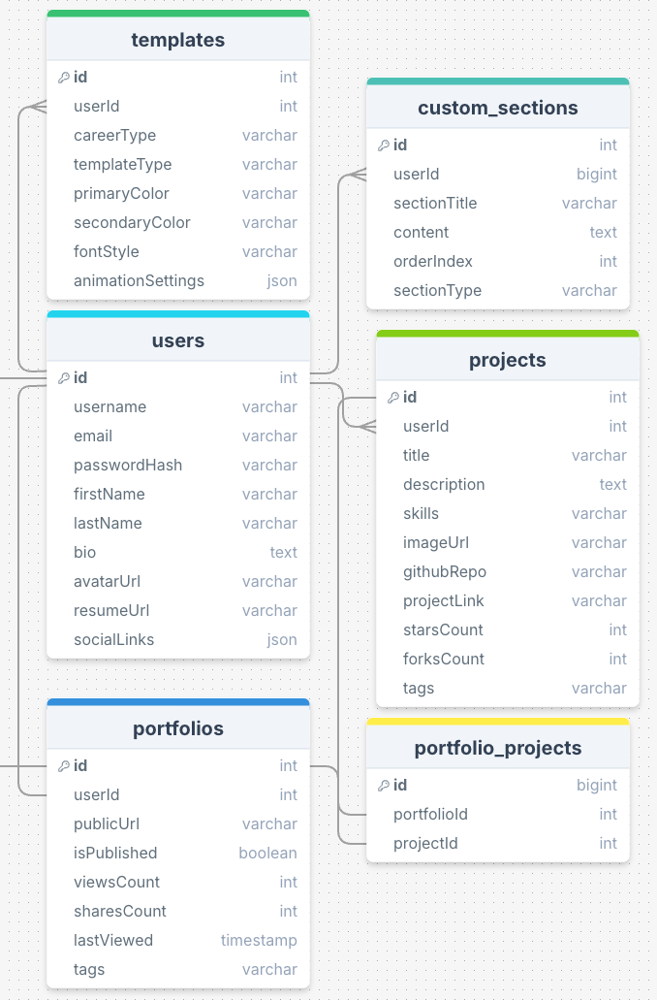

# `ProFolio`

## Database Schema Design



[ProFolio Database Diagram](https://drawsql.app/teams/otter-logic/diagrams/profolio/embed)

<iframe width="100%" height="500" src="https://drawsql.app/teams/otter-logic/diagrams/profolio/embed" frameborder="0" allowfullscreen></iframe>

## API Documentation

## USER AUTHENTICATION/AUTHORIZATION

### All endpoints that require authentication

All endpoints that require a current user to be logged in.

* Request: endpoints that require authentication
* Error Response: Require authentication
  * Status Code: 401
  * Headers:
    * Content-Type: application/json
  * Body:

    ```json
    {
      "message": "Authentication required"
    }
    ```

### All endpoints that require proper authorization

All endpoints that require authentication and the current user does not have the
correct role(s) or permission(s).

* Request: endpoints that require proper authorization
* Error Response: Require proper authorization
  * Status Code: 403
  * Headers:
    * Content-Type: application/json
  * Body:

    ```json
    {
      "message": "Forbidden"
    }
    ```

### Get the Current User

Returns the information about the current user that is logged in.

* Require Authentication: false
* Request
  * Method: GET
  * Route path: /api/users/:id
  * Body: none

* Successful Response when there is a logged in user
  * Status Code: 200
  * Headers:
    * Content-Type: application/json
  * Body:

    ```json
    {
      "user": {
        "id": 1,
        "firstName": "John",
        "lastName": "Smith",
        "email": "john.smith@gmail.com",
        "username": "JohnSmith"
      }
    }
    ```

* Successful Response when there is no logged in user
  * Status Code: 200
  * Headers:
    * Content-Type: application/json
  * Body:

    ```json
    {
      "user": null
    }
    ```

### Log In a User

Logs in a current user with valid credentials and returns the current user's
information.

* Require Authentication: false
* Request
  * Method: POST
  * Route path: /api/session
  * Headers:
    * Content-Type: application/json
  * Body:

    ```json
    {
      "credential": "john.smith@gmail.com",
      "password": "secret password"
    }
    ```

* Successful Response
  * Status Code: 200
  * Headers:
    * Content-Type: application/json
  * Body:

    ```json
    {
      "user": {
        "id": 1,
        "firstName": "John",
        "lastName": "Smith",
        "email": "john.smith@gmail.com",
        "username": "JohnSmith"
      }
    }
    ```

* Error Response: Invalid credentials
  * Status Code: 401
  * Headers:
    * Content-Type: application/json
  * Body:

    ```json
    {
      "message": "Invalid credentials"
    }
    ```

* Error response: Body validation errors
  * Status Code: 400
  * Headers:
    * Content-Type: application/json
  * Body:

    ```json
    {
      "message": "Bad Request", // (or "Validation error" if generated by Sequelize),
      "errors": {
        "credential": "Email or username is required",
        "password": "Password is required"
      }
    }
    ```

### Sign Up a User

Creates a new user, logs them in as the current user, and returns the current
user's information.

* Require Authentication: false
* Request
  * Method: POST
  * Route path: /api/users
  * Headers:
    * Content-Type: application/json
  * Body:

    ```json
    {
      "firstName": "John",
      "lastName": "Smith",
      "email": "john.smith@gmail.com",
      "username": "JohnSmith",
      "password": "secret password"
    }
    ```

* Successful Response
  * Status Code: 201
  * Headers:
    * Content-Type: application/json
  * Body:

    ```json
    {
      "user": {
        "id": 1,
        "firstName": "John",
        "lastName": "Smith",
        "email": "john.smith@gmail.com",
        "username": "JohnSmith"
      }
    }
    ```

* Error response: User already exists with the specified email or username
  * Status Code: 500
  * Headers:
    * Content-Type: application/json
  * Body:

    ```json
    {
      "message": "User already exists",
      "errors": {
        "email": "User with that email already exists",
        "username": "User with that username already exists"
      }
    }
    ```

* Error response: Body validation errors
  * Status Code: 400
  * Headers:
    * Content-Type: application/json
  * Body:

    ```json
    {
      "message": "Bad Request", // (or "Validation error" if generated by Sequelize),
      "errors": {
        "email": "Invalid email",
        "username": "Username is required",
        "firstName": "First Name is required",
        "lastName": "Last Name is required"
      }
    }
    ```

## **Projects**

### **Get all Projects**

Returns all the projects created by the logged-in user.

- **Require Authentication:** true
- **Request:**
  - **Method:** GET
  - **Route path:** `/api/projects`
  - **Body:** none

- **Successful Response:**
  - **Status Code:** 200
  - **Headers:**
    - Content-Type: `application/json`
  - **Body:**
    ```json
    {
      "Projects": [
        {
          "id": 1,
          "userId": 1,
          "title": "Portfolio Website",
          "description": "A personal website to showcase my work.",
          "tags": ["React", "Node.js"],
          "githubRepo": "https://github.com/user/portfolio",
          "projectLink": "https://portfolio.com",
          "imageUrl": "https://cdn.example.com/project-image.png",
          "createdAt": "2025-01-01T12:00:00Z",
          "updatedAt": "2025-01-01T12:30:00Z"
        }
      ]
    }
    ```

---

### **Get Project by ID**

Returns the details of a specific project by its ID.

- **Require Authentication:** true
- **Request:**
  - **Method:** GET
  - **Route path:** `/api/projects/:id`
  - **Body:** none

- **Successful Response:**
  - **Status Code:** 200
  - **Headers:**
    - Content-Type: `application/json`
  - **Body:**
    ```json
    {
      "id": 1,
      "userId": 1,
      "title": "Portfolio Website",
      "description": "A personal website to showcase my work.",
      "tags": ["React", "Node.js"],
      "githubRepo": "https://github.com/user/portfolio",
      "projectLink": "https://portfolio.com",
      "imageUrl": "https://cdn.example.com/project-image.png",
      "createdAt": "2025-01-01T12:00:00Z",
      "updatedAt": "2025-01-01T12:30:00Z"
    }
    ```

- **Error Response:** Project not found
  - **Status Code:** 404
  - **Headers:**
    - Content-Type: `application/json`
  - **Body:**
    ```json
    {
      "message": "Project couldn't be found"
    }
    ```

---

### **Create a Project**

Creates and returns a new project.

- **Require Authentication:** true
- **Request:**
  - **Method:** POST
  - **Route path:** `/api/projects`
  - **Headers:**
    - Content-Type: `application/json`
  - **Body:**
    ```json
    {
      "title": "New Project",
      "description": "A new web app project.",
      "tags": ["Express", "PostgreSQL"],
      "githubRepo": "https://github.com/user/new-project",
      "projectLink": "https://newproject.com",
      "imageUrl": "https://cdn.example.com/project-image.png"
    }
    ```

- **Successful Response:**
  - **Status Code:** 201
  - **Headers:**
    - Content-Type: `application/json`
  - **Body:**
    ```json
    {
      "id": 2,
      "userId": 1,
      "title": "New Project",
      "description": "A new web app project.",
      "tags": ["Express", "PostgreSQL"],
      "githubRepo": "https://github.com/user/new-project",
      "projectLink": "https://newproject.com",
      "imageUrl": "https://cdn.example.com/project-image.png",
      "createdAt": "2025-01-01T14:00:00Z",
      "updatedAt": "2025-01-01T14:00:00Z"
    }
    ```

- **Error Response:** Body validation errors
  - **Status Code:** 400
  - **Headers:**
    - Content-Type: `application/json`
  - **Body:**
    ```json
    {
      "message": "Bad Request",
      "errors": {
        "title": "Title is required",
        "description": "Description is required",
        "tags": "Tags must be an array of strings",
        "githubRepo": "GitHub URL must be a valid URL",
        "projectLink": "Project link must be a valid URL"
      }
    }
    ```

---

### **Update a Project**

Updates and returns an existing project.

- **Require Authentication:** true
- **Require proper authorization:** The project must belong to the current user.
- **Request:**
  - **Method:** PUT
  - **Route path:** `/api/projects/:id/edit`
  - **Headers:**
    - Content-Type: `application/json`
  - **Body:**
    ```json
    {
      "title": "Updated Project Title",
      "description": "Updated project description.",
      "tags": ["React", "Tailwind"],
      "projectLink": "https://updatedproject.com"
    }
    ```

- **Successful Response:**
  - **Status Code:** 200
  - **Headers:**
    - Content-Type: `application/json`
  - **Body:**
    ```json
    {
      "id": 1,
      "userId": 1,
      "title": "Updated Project Title",
      "description": "Updated project description.",
      "tags": ["React", "Tailwind"],
      "githubRepo": "https://github.com/user/portfolio",
      "projectLink": "https://updatedproject.com",
      "imageUrl": "https://cdn.example.com/project-image.png",
      "createdAt": "2025-01-01T12:00:00Z",
      "updatedAt": "2025-01-01T15:00:00Z"
    }
    ```

- **Error Response:** Body validation errors
  - **Status Code:** 400
  - **Headers:**
    - Content-Type: `application/json`
  - **Body:**
    ```json
    {
      "message": "Bad Request",
      "errors": {
        "title": "Title must be less than 100 characters",
        "tags": "Tags must be an array of strings"
      }
    }
    ```

- **Error Response:** Project not found
  - **Status Code:** 404
  - **Headers:**
    - Content-Type: `application/json`
  - **Body:**
    ```json
    {
      "message": "Project couldn't be found"
    }
    ```

---

### **Delete a Project**

Deletes an existing project.

- **Require Authentication:** true
- **Require proper authorization:** The project must belong to the current user.
- **Request:**
  - **Method:** DELETE
  - **Route path:** `/api/projects/:id`
  - **Body:** none

- **Successful Response:**
  - **Status Code:** 200
  - **Headers:**
    - Content-Type: `application/json`
  - **Body:**
    ```json
    {
      "message": "Successfully deleted"
    }
    ```

- **Error Response:** Project not found
  - **Status Code:** 404
  - **Headers:**
    - Content-Type: `application/json`
  - **Body:**
    ```json
    {
      "message": "Project couldn't be found"
    }
    ```

## **Portfolios**

### **Get Portfolio Details**

Returns the public portfolio details for the specified user.

- **Require Authentication:** true
- **Request:**
  - **Method:** GET
  - **Route path:** `/api/portfolios/:userId`
  - **Body:** none

- **Successful Response:**
  - **Status Code:** 200
  - **Headers:**
    - Content-Type: `application/json`
  - **Body:**
    ```json
    {
      "id": 1,
      "userId": 1,
      "publicUrl": "https://profolio.user.com",
      "isPublished": true,
      "viewsCount": 250,
      "sharesCount": 50,
      "lastViewed": "2025-01-07T12:00:00Z"
    }
    ```

- **Error Response:** Portfolio not found
  - **Status Code:** 404
  - **Headers:**
    - Content-Type: `application/json`
  - **Body:**
    ```json
    {
      "message": "Portfolio couldn't be found"
    }
    ```

---

### **Create a Portfolio**

Creates and returns a new portfolio for the user.

- **Require Authentication:** true
- **Request:**
  - **Method:** POST
  - **Route path:** `/api/portfolios`
  - **Headers:**
    - Content-Type: `application/json`
  - **Body:**
    ```json
    {
      "publicUrl": "https://profolio.user.com",
      "isPublished": true
    }
    ```

- **Successful Response:**
  - **Status Code:** 201
  - **Headers:**
    - Content-Type: `application/json`
  - **Body:**
    ```json
    {
      "id": 1,
      "userId": 1,
      "publicUrl": "https://profolio.user.com",
      "isPublished": true,
      "viewsCount": 0,
      "sharesCount": 0,
      "lastViewed": null,
      "createdAt": "2025-01-07T14:00:00Z",
      "updatedAt": "2025-01-07T14:00:00Z"
    }
    ```

- **Error Response:** Body validation errors
  - **Status Code:** 400
  - **Headers:**
    - Content-Type: `application/json`
  - **Body:**
    ```json
    {
      "message": "Bad Request",
      "errors": {
        "publicUrl": "Public URL is required",
        "isPublished": "Publish status must be true or false"
      }
    }
    ```

---

### **Update a Portfolio**

Updates and returns the existing portfolio.

- **Require Authentication:** true
- **Require proper authorization:** The portfolio must belong to the current user.
- **Request:**
  - **Method:** PUT
  - **Route path:** `/api/portfolios/:id/edit`
  - **Headers:**
    - Content-Type: `application/json`
  - **Body:**
    ```json
    {
      "isPublished": false
    }
    ```

- **Successful Response:**
  - **Status Code:** 200
  - **Headers:**
    - Content-Type: `application/json`
  - **Body:**
    ```json
    {
      "id": 1,
      "userId": 1,
      "publicUrl": "https://profolio.user.com",
      "isPublished": false,
      "viewsCount": 250,
      "sharesCount": 50,
      "lastViewed": "2025-01-07T12:00:00Z",
      "updatedAt": "2025-01-07T15:00:00Z"
    }
    ```

- **Error Response:** Portfolio not found
  - **Status Code:** 404
  - **Headers:**
    - Content-Type: `application/json`
  - **Body:**
    ```json
    {
      "message": "Portfolio couldn't be found"
    }
    ```

---

### **Delete a Portfolio**

Deletes an existing portfolio.

- **Require Authentication:** true
- **Require proper authorization:** The portfolio must belong to the current user.
- **Request:**
  - **Method:** DELETE
  - **Route path:** `/api/portfolios/:id`
  - **Body:** none

- **Successful Response:**
  - **Status Code:** 200
  - **Headers:**
    - Content-Type: `application/json`
  - **Body:**
    ```json
    {
      "message": "Successfully deleted"
    }
    ```

- **Error Response:** Portfolio not found
  - **Status Code:** 404
  - **Headers:**
    - Content-Type: `application/json`
  - **Body:**
    ```json
    {
      "message": "Portfolio couldn't be found"
    }
    ```

    ## **Feedback**

### **Get all Feedback for a Portfolio**

Returns all feedback comments for a specific portfolio.

- **Require Authentication:** false
- **Request:**
  - **Method:** GET
  - **Route path:** `/api/feedback/:portfolioId`
  - **Body:** none

- **Successful Response:**
  - **Status Code:** 200
  - **Headers:**
    - Content-Type: `application/json`
  - **Body:**
    ```json
    {
      "Feedback": [
        {
          "id": 1,
          "portfolioId": 1,
          "viewerName": "Alex Doe",
          "commentText": "Amazing portfolio!",
          "createdAt": "2025-01-07T12:00:00Z"
        },
        {
          "id": 2,
          "portfolioId": 1,
          "viewerName": "John Smith",
          "commentText": "I love your work!",
          "createdAt": "2025-01-07T12:05:00Z"
        }
      ]
    }
    ```

- **Error Response:** Portfolio not found
  - **Status Code:** 404
  - **Headers:**
    - Content-Type: `application/json`
  - **Body:**
    ```json
    {
      "message": "Portfolio couldn't be found"
    }
    ```

---

### **Create Feedback for a Portfolio**

Adds a new feedback comment to a portfolio.

- **Require Authentication:** false
- **Request:**
  - **Method:** POST
  - **Route path:** `/api/feedback`
  - **Headers:**
    - Content-Type: `application/json`
  - **Body:**
    ```json
    {
      "portfolioId": 1,
      "viewerName": "Jane Doe",
      "commentText": "Very inspiring work!"
    }
    ```

- **Successful Response:**
  - **Status Code:** 201
  - **Headers:**
    - Content-Type: `application/json`
  - **Body:**
    ```json
    {
      "id": 3,
      "portfolioId": 1,
      "viewerName": "Jane Doe",
      "commentText": "Very inspiring work!",
      "createdAt": "2025-01-07T14:00:00Z"
    }
    ```

- **Error Response:** Body validation errors
  - **Status Code:** 400
  - **Headers:**
    - Content-Type: `application/json`
  - **Body:**
    ```json
    {
      "message": "Bad Request",
      "errors": {
        "portfolioId": "Portfolio ID is required",
        "viewerName": "Viewer name is required",
        "commentText": "Comment text is required"
      }
    }
    ```

---

### **Update Feedback**

Updates an existing feedback comment.

- **Require Authentication:** false
- **Request:**
  - **Method:** PUT
  - **Route path:** `/api/feedback/:id/edit`
  - **Headers:**
    - Content-Type: `application/json`
  - **Body:**
    ```json
    {
      "commentText": "Updated feedback comment."
    }
    ```

- **Successful Response:**
  - **Status Code:** 200
  - **Headers:**
    - Content-Type: `application/json`
  - **Body:**
    ```json
    {
      "id": 1,
      "portfolioId": 1,
      "viewerName": "Alex Doe",
      "commentText": "Updated feedback comment.",
      "createdAt": "2025-01-07T12:00:00Z",
      "updatedAt": "2025-01-07T15:00:00Z"
    }
    ```

- **Error Response:** Feedback not found
  - **Status Code:** 404
  - **Headers:**
    - Content-Type: `application/json`
  - **Body:**
    ```json
    {
      "message": "Feedback couldn't be found"
    }
    ```

---

### **Delete Feedback**

Deletes an existing feedback comment.

- **Require Authentication:** false
- **Request:**
  - **Method:** DELETE
  - **Route path:** `/api/feedback/:id`
  - **Body:** none

- **Successful Response:**
  - **Status Code:** 200
  - **Headers:**
    - Content-Type: `application/json`
  - **Body:**
    ```json
    {
      "message": "Successfully deleted"
    }
    ```

- **Error Response:** Feedback not found
  - **Status Code:** 404
  - **Headers:**
    - Content-Type: `application/json`
  - **Body:**
    ```json
    {
      "message": "Feedback couldn't be found"
    }
    ```

## **Custom Sections**

### **Get all Custom Sections for a User**

Returns all custom sections for the specified user.

- **Require Authentication:** true
- **Request:**
  - **Method:** GET
  - **Route path:** `/api/custom_sections/:userId`
  - **Body:** none

- **Successful Response:**
  - **Status Code:** 200
  - **Headers:**
    - Content-Type: `application/json`
  - **Body:**
    ```json
    {
      "CustomSections": [
        {
          "id": 1,
          "userId": 1,
          "sectionTitle": "Certifications",
          "content": "AWS Certified Solutions Architect",
          "sectionType": "list",
          "orderIndex": 1,
          "createdAt": "2025-01-07T12:00:00Z",
          "updatedAt": "2025-01-07T12:30:00Z"
        },
        {
          "id": 2,
          "userId": 1,
          "sectionTitle": "Volunteer Work",
          "content": "Taught coding to underprivileged youth.",
          "sectionType": "text",
          "orderIndex": 2,
          "createdAt": "2025-01-07T12:05:00Z",
          "updatedAt": "2025-01-07T12:35:00Z"
        }
      ]
    }
    ```

---

### **Create a Custom Section**

Creates and returns a new custom section for the user.

- **Require Authentication:** true
- **Request:**
  - **Method:** POST
  - **Route path:** `/api/custom_sections`
  - **Headers:**
    - Content-Type: `application/json`
  - **Body:**
    ```json
    {
      "userId": 1,
      "sectionTitle": "Awards",
      "content": "Received Hackathon MVP Award.",
      "sectionType": "text",
      "orderIndex": 3
    }
    ```

- **Successful Response:**
  - **Status Code:** 201
  - **Headers:**
    - Content-Type: `application/json`
  - **Body:**
    ```json
    {
      "id": 3,
      "userId": 1,
      "sectionTitle": "Awards",
      "content": "Received Hackathon MVP Award.",
      "sectionType": "text",
      "orderIndex": 3,
      "createdAt": "2025-01-07T14:00:00Z",
      "updatedAt": "2025-01-07T14:00:00Z"
    }
    ```

- **Error Response:** Body validation errors
  - **Status Code:** 400
  - **Headers:**
    - Content-Type: `application/json`
  - **Body:**
    ```json
    {
      "message": "Bad Request",
      "errors": {
        "sectionTitle": "Section title is required",
        "content": "Content is required",
        "sectionType": "Section type must be either 'text', 'list', or 'gallery'"
      }
    }
    ```

---

### **Update a Custom Section**

Updates and returns an existing custom section.

- **Require Authentication:** true
- **Require proper authorization:** The section must belong to the current user.
- **Request:**
  - **Method:** PUT
  - **Route path:** `/api/custom_sections/:id/edit`
  - **Headers:**
    - Content-Type: `application/json`
  - **Body:**
    ```json
    {
      "sectionTitle": "Updated Section Title",
      "content": "Updated content for the custom section.",
      "sectionType": "text"
    }
    ```

- **Successful Response:**
  - **Status Code:** 200
  - **Headers:**
    - Content-Type: `application/json`
  - **Body:**
    ```json
    {
      "id": 1,
      "userId": 1,
      "sectionTitle": "Updated Section Title",
      "content": "Updated content for the custom section.",
      "sectionType": "text",
      "orderIndex": 1,
      "createdAt": "2025-01-07T12:00:00Z",
      "updatedAt": "2025-01-07T15:00:00Z"
    }
    ```

- **Error Response:** Custom section not found
  - **Status Code:** 404
  - **Headers:**
    - Content-Type: `application/json`
  - **Body:**
    ```json
    {
      "message": "Custom section couldn't be found"
    }
    ```

---

### **Delete a Custom Section**

Deletes an existing custom section.

- **Require Authentication:** true
- **Require proper authorization:** The section must belong to the current user.
- **Request:**
  - **Method:** DELETE
  - **Route path:** `/api/custom_sections/:id`
  - **Body:** none

- **Successful Response:**
  - **Status Code:** 200
  - **Headers:**
    - Content-Type: `application/json`
  - **Body:**
    ```json
    {
      "message": "Successfully deleted"
    }
    ```

- **Error Response:** Custom section not found
  - **Status Code:** 404
  - **Headers:**
    - Content-Type: `application/json`
  - **Body:**
    ```json
    {
      "message": "Custom section couldn't be found"
    }
    ```